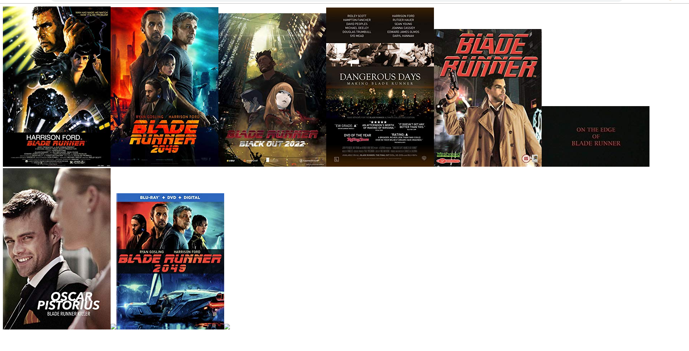

**Задание**

Отобразить на странице (в элементе ``<div id="movies"></div>``) список изображений(постеров) какого-либо
фильма. Для получения данных использовать OMDb API.

[Документация по работе с OMDb API](https://www.omdbapi.com/)(получить [API Key](http://www.omdbapi.com/apikey.aspx))

Пример:



**Требования, материалы для выполнения лабораторной работы:**
- Используемые технологии при выполнении задания - js, html
- Запросы к API делать с помощью [XMLHttpRequest](https://developer.mozilla.org/ru/docs/XMLHttpRequest),
и [Promise](https://developer.mozilla.org/ru/docs/Web/JavaScript/Reference/Global_Objects/Promise).
- Для работы с элементами страницы [Документ, события, интерфейсы](https://learn.javascript.ru/ui)
- [Создание елементов](https://developer.mozilla.org/en-US/docs/Web/API/Document/createElement)
- [Изменение атрибутов](https://learn.javascript.ru/dom-attributes-and-properties)

Структура проекта

```
│   index.html
│
└───src
        main.js
```
Файл `index.html` остается без изменений, выполнять лабораторную работу в файле `src/main.js`.
